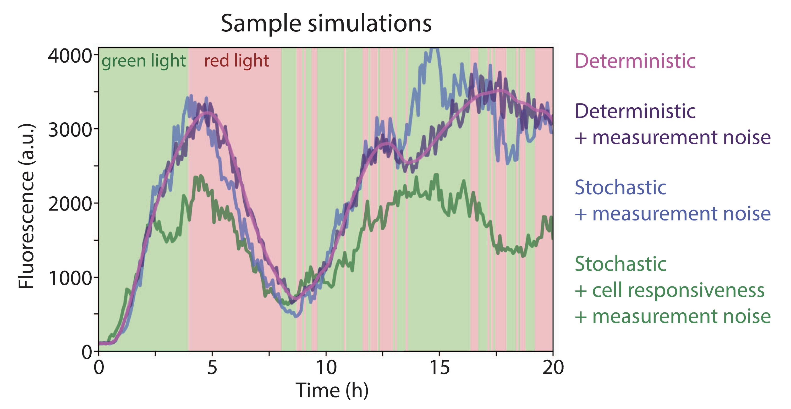

This project studies inverse control of simulated single-cell gene expression under the CcaS/CcaR optogenetic system.
Given a cell's recent fluorescence history, recent light history, and desired future fluorescence target, a neural network predicts the future binary light stimulation needed to drive the cell toward that target.
Unlike prior response-prediction models for [deepcellcontrol](https://gitlab.com/dunloplab/deepcellcontrol) [[1](https://doi.org/10.1021/acssynbio.3c00203), [2](https://doi.org/10.1038/s41467-024-46361-1)], this model directly predicts the control signal.
During training, the predicted light sequence is passed through a deterministic differentiable CcaSR ODE layer, and the resulting simulated fluorescence is compared with the target future fluorescence.

See the project [presentation](https://cdn.jsdelivr.net/gh/tianrui-qi/GEPC@main/asset/presentation.pdf) for an overview.
This README describes how to run the pipeline and reproduce the analysis.

## Installation

### Environment

This project is built using [PyTorch Lightning](https://github.com/Lightning-AI/pytorch-lightning) (`lightning=2.5`) for deep learning model development and [Hydra](https://github.com/facebookresearch/hydra) (`hydra-core=1.3`) for configuration management.
Cell simulation is adapted from [deepcellcontrol](https://gitlab.com/dunloplab/deepcellcontrol), with deterministic simulations handled by [SciPy](https://github.com/scipy/scipy) ODE integration and stochastic simulations handled by [GillesPy2](https://github.com/StochSS/GillesPy2).
Python dependencies are managed with [Conda](https://docs.conda.io/en/latest/).
To set up the environment:

```bash
# clone the repository
git clone https://github.com/tianrui-qi/GEPC.git
cd GEPC
# create the conda environment
conda env create -f environment.yaml
conda activate gepc
```

### Data

Simulated cell pools, trained model checkpoints, and TensorBoard training logs are available on [OSF](https://osf.io/mnvcz/).
You can download them from the command line as follows:

```bash
# clone the OSF storage
osf --project mnvcz clone
# merge OSF storage into the project root
rsync -av --progress mnvcz/osfstorage/data/ ./data/
rm -r mnvcz
```

After downloading the OSF artifacts, the repository should contain:

```text
data/
├── simulate/*.pkl    # simulated cell pools for training and validation
├── train-ckpt/       # trained model checkpoints
└── train-log/        # TensorBoard logs from training
```

Downloading these artifacts is the quickest way to reproduce the [Analysis](#analysis) results shown in the [presentation](https://cdn.jsdelivr.net/gh/tianrui-qi/GEPC@main/asset/presentation.pdf).
Alternatively, you can skip this step and run the pipeline from scratch by generating simulation pools as described in [Simulation](#simulation), then training models as described in [Training](#training).
All datasets in this project are simulated, and the provided checkpoints were trained on simulated data.
The pipeline sets random seeds, so reruns are expected to be reproducible.
Stochastic GillesPy2 simulations may still show small differences because not all solver-level randomness is guaranteed to be fully controlled across runs or platforms.

## Simulation

The provided simulation data are stored under `data/simulate/` as eight `.pkl` files: four simulation styles, each with one `Train` pool and one `Valid` pool.
`Train` pools are used for model training, whereas `Valid` pools are used for validation during training and for notebook analysis.
Each training pool contains 100 cells; each validation pool contains 10 cells.
Each cell is simulated for 320 time points sampled every 5 minutes and stores:

- `observed`: measured GFP fluorescence after the camera model.
- `stimulus`: binary light stimulation sequence.
- `cell_E`: cell responsiveness used by the CcaSR model.
- `cell_seed`, `sim_seed`, `measure_seed`: seeds for cell initialization, stochastic simulation, and measurement noise.

The four simulation styles follow the progression used in the [deepcellcontrol](https://gitlab.com/dunloplab/deepcellcontrol) literature [[1](https://doi.org/10.1021/acssynbio.3c00203)], moving from deterministic dynamics to stochastic dynamics with measurement noise and cell-to-cell responsiveness variation.

| Style | Solver | Cell responsiveness | Camera noise |
| --- | --- | --- | --- |
| `Style1` | ODE | fixed `E` | none |
| `Style2` | ODE | fixed `E` | 5% |
| `Style3` | GillesPy2 | fixed `E` | 5% |
| `Style4` | GillesPy2 | variable `E` | 5% |



To generate a simulation pool, run [`script/simulate.py`](script/simulate.py) with one of the simulation presets:

```bash
python -m script.simulate --config-name experiment/simulate/${style}-${pool}
# ${style}: Style1, Style2, Style3, or Style4
# ${pool}: Train or Valid
```

We use [Hydra](https://github.com/facebookresearch/hydra)'s syntax to define, manage, and override simulation parameters.
The template simulation pipeline is defined in [`config/pipeline/simulate.yaml`](config/pipeline/simulate.yaml), and the eight runnable presets under [`config/experiment/simulate/`](config/experiment/simulate/) inherit from this template pipeline.
The provided simulation pools on [OSF](https://osf.io/mnvcz/) were generated from these presets.
To define a new simulation setting, create a new `.yaml` preset under [`config/experiment/simulate/`](config/experiment/simulate/) and pass it to `--config-name`.
[Hydra](https://github.com/facebookresearch/hydra) also supports command-line overrides for any config parameter.
For example, to generate 200 cells for a training pool:

```bash
python -m script.simulate --config-name experiment/simulate/${style}-Train simulator.num_cells=200
# ${style}: Style1, Style2, Style3, or Style4
```

Please refer to [Hydra](https://github.com/facebookresearch/hydra)'s
[documentation](https://hydra.cc/docs/intro/)
for additional configuration features.

By default, simulated data are saved to `data/simulate/${name}.pkl`, where `name` is a required config value when running the simulation script.
This path can also be changed directly by overriding `simulator.data_save_path`.

## Training

The provided model checkpoints are stored under `data/train-ckpt/` as eight checkpoint folders, with TensorBoard logs stored under `data/train-log/`.
[PyTorch Lightning](https://github.com/Lightning-AI/pytorch-lightning) manages both checkpointing and TensorBoard logging.
Each training run saves `last.ckpt` and `best.ckpt`, where `best.ckpt` is selected by the lowest validation loss.
Training metrics, including loss, RMSE, MAE, and learning rate, are logged to TensorBoard.

The trainable model maps recent cell history and a desired future target to future light stimulation:

```text
past fluorescence + past light + future target -> predicted future light
```

The training objective is implemented in [`src/objective.py`](src/objective.py): predicted future light is passed through a differentiable deterministic CcaSR ODE layer, and the resulting simulated fluorescence is compared with the target future fluorescence.

The eight training presets are the model-training runs used by the analyses in [Analysis](#analysis).
They vary simulation style, input history length, and model architecture.
The default prediction horizon is 12 future steps, which is 1 hour at 5-minute sampling; the baseline uses 36 past steps, which is 3 hours of history.

| Config | Purpose |
| --- | --- |
| `Style1-Past36-LSTM` | Train on deterministic ODE data without measurement noise |
| `Style2-Past36-LSTM` | Train on deterministic ODE data with measurement noise |
| `Style3-Past36-LSTM` | Train on stochastic GillesPy2 data with measurement noise |
| `Style4-Past36-LSTM` | Baseline LSTM trained on stochastic data with variable responsiveness |
| `Style4-Past12-LSTM` | 1 hour input-history ablation |
| `Style4-Past24-LSTM` | 2 hour input-history ablation |
| `Style4-Past48-LSTM` | 4 hour input-history ablation |
| `Style4-Past36-Transformer` | Transformer architecture ablation against the LSTM baseline |

To train a model, run [`script/train.py`](script/train.py) with one of the training presets:

```bash
python -m script.train --config-name experiment/train/${config}
# ${config}: preset defined in config/experiment/train/
```

For example, to train the baseline LSTM model:

```bash
python -m script.train --config-name experiment/train/Style4-Past36-LSTM
```

We use [Hydra](https://github.com/facebookresearch/hydra)'s syntax to define, manage, and override training parameters.
The template training pipeline is defined in [`config/pipeline/train.yaml`](config/pipeline/train.yaml), and the eight runnable presets under [`config/experiment/train/`](config/experiment/train/) inherit from this template pipeline.
The provided checkpoints and TensorBoard logs on [OSF](https://osf.io/mnvcz/) were generated from these presets.
To define a new training setting, create a new `.yaml` preset under [`config/experiment/train/`](config/experiment/train/) and pass it to `--config-name`.
Please refer to [Hydra](https://github.com/facebookresearch/hydra)'s
[documentation](https://hydra.cc/docs/intro/)
for additional configuration features.

By default, TensorBoard logs are saved to `data/train-log/${name}/`, and model checkpoints are saved to `data/train-ckpt/${name}/`, where `name` is a required config value when running the training script.
These paths can also be changed directly by overriding `trainer.log_save_fold` and `trainer.ckpt_save_fold`.

To inspect training curves:

```bash
tensorboard --logdir data/train-log/
```

The [training pipeline](script/train.py) is modularized into four components: [data](src/data.py), [model](src/model/), [objective](src/objective.py), and [trainer](src/trainer.py).
The implementation follows the [PyTorch](https://github.com/pytorch/pytorch) and [PyTorch Lightning](https://github.com/Lightning-AI/pytorch-lightning) APIs:

```text
src/
├── data.py            # inherits: lightning.LightningDataModule
├── model/             # inherits: torch.nn.Module
├── objective.py       # inherits: lightning.LightningModule
└── trainer.py         # wrapper:  lightning.Trainer
```

The current pipeline can therefore be modified and extended by following these APIs.
See the implementation for more details.

## Analysis

Post-training analysis is organized into notebooks by study goal: evaluation notebooks keep the trained model fixed and change the prediction target or visualization, whereas ablation notebooks change the trained model while keeping the evaluation setting controlled.
Each notebook loads the required validation pools from `data/simulate/` and trained checkpoints from `data/train-ckpt/`, runs prediction online, computes normalized MAE-based summaries, and saves the final figures to [`asset/`](asset/).

| Notebook | Study goal |
| --- | --- |
| [`notebook/evaluation-Base.ipynb`](notebook/evaluation-Base.ipynb) | Evaluate the baseline `Style4-Past36-LSTM` model on the standard 8-hour cosine target |
| [`notebook/evaluation-ErrorRelateToCosineTargetPeriod.ipynb`](notebook/evaluation-ErrorRelateToCosineTargetPeriod.ipynb) | Test how baseline error changes as the cosine target period changes |
| [`notebook/ablation-ModelArchitectures.ipynb`](notebook/ablation-ModelArchitectures.ipynb) | Compare LSTM and Transformer models under the same training style, input length, and evaluation target |
| [`notebook/ablation-DataSimulationMethod.ipynb`](notebook/ablation-DataSimulationMethod.ipynb) | Compare models trained on different simulation styles while holding architecture and input length fixed |
| [`notebook/ablation-InputLength.ipynb`](notebook/ablation-InputLength.ipynb) | Compare models trained with 1, 2, 3, and 4 hours of past input history |

Together, these notebooks reproduce all figures shown in the project [presentation](https://cdn.jsdelivr.net/gh/tianrui-qi/GEPC@main/asset/presentation.pdf).

## Acknowledgements

This project was developed by [Tianrui Qi](https://www.linkedin.com/in/tianrui-qi/) during his Ph.D. lab rotation in the [Dunlop Lab](http://www.dunloplab.com) at Boston University.
Thanks to [Dr. Mary Dunlop](https://www.linkedin.com/in/mary-dunlop-5328756/) for hosting the rotation and to [Dr. Hossein Moghimian](https://www.linkedin.com/in/hossein-moghimian-783251103/) for his support throughout the project.

## References

1.  Klumpe, H. E., Lugagne, J.-B., Khalil, A. S. & Dunlop, M. J. Deep neural networks for predicting single-cell responses and probability landscapes. *ACS Synth. Biol.* **12**, 2367-2381 (2023). [doi:10.1021/acssynbio.3c00203](https://doi.org/10.1021/acssynbio.3c00203).
2.  Lugagne, J.-B., Blassick, C. M. & Dunlop, M. J. Deep model predictive control of gene expression in thousands of single cells. *Nat. Commun.* **15**, 2148 (2024). [doi:10.1038/s41467-024-46361-1](https://doi.org/10.1038/s41467-024-46361-1).
