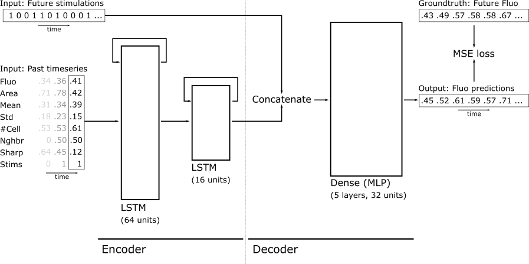

Neural Network Models
=======================

There is essentially a single encoder-decoder neural network, defined by
``lstm_mlp`` in the ``models`` module. 

The encoder part of the model consists in two successive LSTM layers that 
compact the normalized past timeseries of N timesteps x 8 features into a 
latent vector of 32 elements (16 units w/ cell state + hidden state). 

This 32-dimensional vector is then concatenated with the timeseries of future
optogenetic stimulations (which can have 12, 24, 36, or 48 elements depending
on the prediction horizon). This concatenated vector is then fed as input
to the decoder part of the model, and MLP with 5 layers of 32 neurons.

During training, the output of this whole network is trained against the know
response of the cell. However, when running the model predictive control 
framework, the past of the cell only needs to be encoded once, while the
decoder needs to predict the cell response against hundreds or thousands of 
potential future optogenetic stimulations. For this reason, the module also
contains model definitions and utility functions that are used to split the
trained encoder-decoder model into its encoder and decoder components, so 
that they can run independently.

The reason why the encoder is based on LSTM layers while the decoder is an MLP 
is because LSTMs are better suited for timeseries, and can handle any 
timeseries length, but their computation can not be efficiently parallelized. 
On the other hand, MLPs can be parallelized efficiently. Since the encoder 
needs to be run only once per cell while the decoder needs to run 100s of time
per cell, we opted for this compromise.